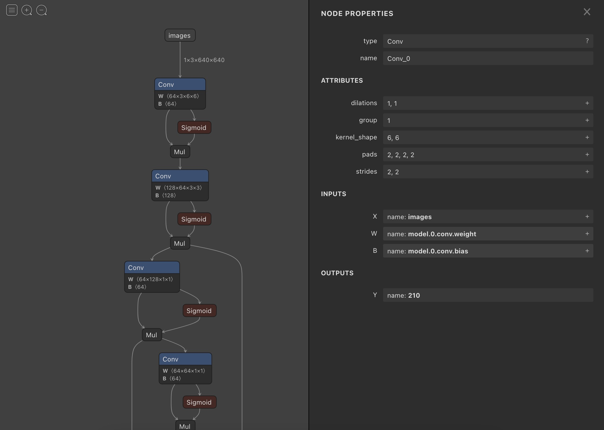

# pytorch-onnx-exporter
Tool to export pytorch model as onnx graph, based on [torch.onnx](https://pytorch.org/docs/stable/onnx.html).

### Prerequisites

- [direnv](https://direnv.net/)

- [pyenv](https://github.com/pyenv/pyenv)

- `pip install -r requirements.txt`

### Usage:

#### Exporting a model from saved local file:
```
python exporter.py -m model.pt -o output/model.onnx
```
#### Exporting a torchvision model:
```
python exporter.py -m detection.maskrcnn_resnet50_fpn
```
#### Exporting a model from Pytorch Hub:
```
python exporter.py --hub-repo ultralytics/yolov5 -m yolov5s
```
 
### Visualization
Any onnx visualization tools are ok, I recommand [Netron](https://github.com/lutzroeder/netron):
